# Mythril: Content & Unlock Web
**Last Updated:** March 5, 2026

This document provides a comprehensive overview of all content in Mythril, including quest lines, cadence progression, and location unlocking.

## 🗺️ Progression Map

```mermaid
graph TD
classDef quest fill:#f9f,stroke:#333,stroke-width:2px;
classDef location fill:#ccf,stroke:#333,stroke-width:2px;
classDef cadence fill:#cfc,stroke:#333,stroke-width:2px;
classDef root fill:#ff9,stroke:#333,stroke-width:4px;
quest_prologue["Prologue"]:::root
quest_tutorial_section["Tutorial Section"]:::quest
quest_prologue -->|Requires| quest_tutorial_section
quest_visit_starting_town["Visit Starting Town"]:::quest
quest_tutorial_section -->|Requires| quest_visit_starting_town
quest_buy_potion["Buy Potion"]:::quest
quest_visit_starting_town -->|Requires| quest_buy_potion
quest_recover_the_ancient_tome["Recover the Ancient Tome"]:::quest
quest_visit_starting_town -->|Requires| quest_recover_the_ancient_tome
quest_recover_the_ancient_tome ==>|Unlocks| cadence_arcanist
quest_learn_about_cadences["Learn About Cadences"]:::quest
quest_visit_starting_town -->|Requires| quest_learn_about_cadences
quest_learn_about_cadences ==>|Unlocks| cadence_recruit
quest_learn_about_the_dark_forest["Learn about the Dark Forest"]:::quest
quest_learn_about_the_mines -->|Requires| quest_learn_about_the_dark_forest
quest_learn_about_the_dark_forest ==>|Unlocks| cadence_student
quest_hunt_goblins["Hunt Goblins"]:::quest
quest_learn_about_the_dark_forest -->|Requires| quest_hunt_goblins
quest_chop_wood["Chop Wood"]:::quest
quest_learn_about_the_dark_forest -->|Requires| quest_chop_wood
quest_learn_about_the_mines["Learn about the Mines"]:::quest
quest_learn_about_cadences -->|Requires| quest_learn_about_the_mines
quest_learn_about_the_mines ==>|Unlocks| cadence_apprentice
quest_hunt_bats["Hunt Bats"]:::quest
quest_learn_about_the_mines -->|Requires| quest_hunt_bats
quest_hunt_spiders["Hunt Spiders"]:::quest
quest_hunt_bats -->|Requires| quest_hunt_spiders
quest_hunt_slimes["Hunt Slimes"]:::quest
quest_hunt_spiders -->|Requires| quest_hunt_slimes
quest_unlock_mining["Unlock Mining"]:::quest
quest_hunt_slimes -->|Requires| quest_unlock_mining
quest_mine_iron_ore["Mine Iron Ore"]:::quest
quest_unlock_mining -->|Requires| quest_mine_iron_ore
quest_gather_moonberries["Gather Moonberries"]:::quest
quest_learn_about_the_dark_forest -->|Requires| quest_gather_moonberries
quest_defeat_treant_guardian["Defeat Treant Guardian"]:::quest
quest_gather_moonberries -->|Requires| quest_defeat_treant_guardian
quest_ancient_inscriptions["Ancient Inscriptions"]:::quest
quest_learn_about_cadences -->|Requires| quest_ancient_inscriptions
quest_finding_the_hearth["Finding the Hearth"]:::quest
quest_ancient_inscriptions -->|Requires| quest_finding_the_hearth
quest_rekindling_the_spark["Rekindling the Spark"]:::quest
quest_finding_the_hearth -->|Requires| quest_rekindling_the_spark
quest_rekindling_the_spark ==>|Unlocks| cadence_mythril_weaver
quest_help_the_lumberjack["Help the lumberjack"]:::quest
quest_learn_about_the_dark_forest -->|Requires| quest_help_the_lumberjack
quest_sell_gem["Sell Gem"]:::quest
quest_visit_starting_town -->|Requires| quest_sell_gem
quest_scavenge_scrap["Scavenge Scrap"]:::quest
quest_hunt_sand_sharks["Hunt Sand-Sharks"]:::quest
quest_locate_the_hidden_oasis["Locate the Hidden Oasis"]:::quest
quest_purify_the_grove["Purify the Grove"]:::quest
quest_power_the_forge["Power the Forge"]:::quest
quest_shatter_the_crystals["Shatter the Crystals"]:::quest
quest_finding_the_hearth -->|Requires| quest_shatter_the_crystals
quest_high_altitude_survey["High Altitude Survey"]:::quest
quest_shatter_the_crystals -->|Requires| quest_high_altitude_survey
quest_harvest_sea_life["Harvest Sea-Life"]:::quest
quest_locate_the_hidden_oasis -->|Requires| quest_harvest_sea_life
quest_deep_sea_scavenge["Deep Sea Scavenge"]:::quest
quest_harvest_sea_life -->|Requires| quest_deep_sea_scavenge
quest_archive_sifting["Archive Sifting"]:::quest
quest_ancient_inscriptions -->|Requires| quest_archive_sifting
quest_study_ancient_texts["Study Ancient Texts"]:::quest
quest_archive_sifting -->|Requires| quest_study_ancient_texts
quest_defeat_the_mythril_construct["Defeat the Mythril Construct"]:::quest
quest_power_the_forge -->|Requires| quest_defeat_the_mythril_construct
quest_ascetic_meditation["Ascetic Meditation"]:::quest
quest_defeat_the_mythril_construct -->|Requires| quest_ascetic_meditation
quest_heavy_training["Heavy Training"]:::quest
quest_defeat_the_mythril_construct -->|Requires| quest_heavy_training
location_village["Village"]:::location
location_greenwood_forest["Greenwood Forest"]:::location
quest_tutorial_section -->|Requires| location_greenwood_forest
location_dark_forest["Dark Forest"]:::location
quest_learn_about_the_dark_forest -->|Requires| location_dark_forest
location_sun_drenched_plains["Sun-drenched Plains"]:::location
quest_visit_starting_town -->|Requires| location_sun_drenched_plains
location_forgotten_mines["Forgotten Mines"]:::location
quest_learn_about_the_mines -->|Requires| location_forgotten_mines
location_deep_mines["Deep Mines"]:::location
quest_learn_about_the_mines -->|Requires| location_deep_mines
location_crystal_peaks["Crystal Peaks"]:::location
quest_power_the_forge -->|Requires| location_crystal_peaks
location_tidal_caverns["Tidal Caverns"]:::location
quest_hunt_sand_sharks -->|Requires| location_tidal_caverns
location_hidden_oasis["Hidden Oasis"]:::location
quest_locate_the_hidden_oasis -->|Requires| location_hidden_oasis
location_ancient_library["Ancient Library"]:::location
quest_ancient_inscriptions -->|Requires| location_ancient_library
location_ancient_ruins["Ancient Ruins"]:::location
quest_recover_the_ancient_tome -->|Requires| location_ancient_ruins
location_mythril_sanctum["Mythril Sanctum"]:::location
quest_rekindling_the_spark -->|Requires| location_mythril_sanctum
cadence_recruit["Recruit"]:::cadence
cadence_arcanist["Arcanist"]:::cadence
cadence_apprentice["Apprentice"]:::cadence
cadence_student["Student"]:::cadence
cadence_mythril_weaver["Mythril Weaver"]:::cadence
cadence_the_sentinel["The Sentinel"]:::cadence
cadence_scholar["Scholar"]:::cadence
cadence_geologist["Geologist"]:::cadence
cadence_tide_caller["Tide-Caller"]:::cadence
cadence_slayer["Slayer"]:::cadence
```

